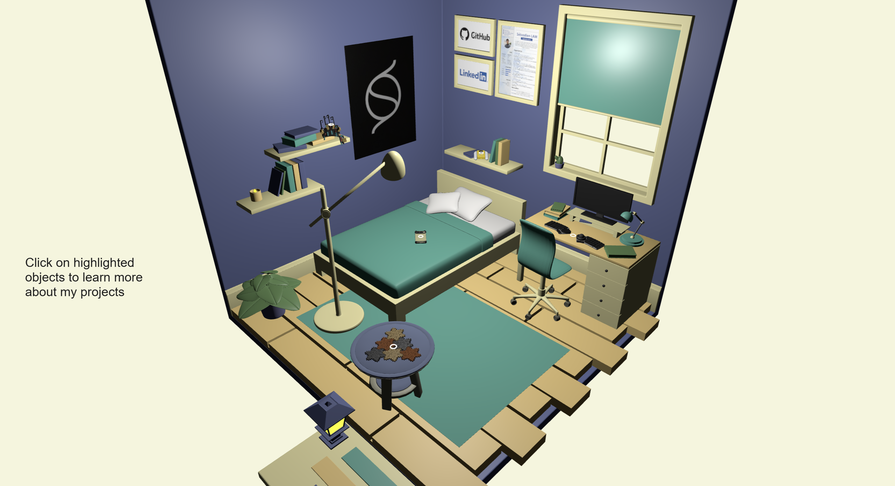

# Interactive Portfolio


Welcome to my portfolio, built using **THREE.js** and showcasing my professional projects and achievements. This portfolio uses an immersive 3D environment with clickable objects to explore various projects. Each project has a unique description, highlighting my involvement and contributions.

This project's scene draws inspiration from **oscarqjh's** portfolio. The Github page of this project is available [here](https://github.com/oscarqjh/threejs-portfolio/tree/main). 

## Features

- **3D Scene**: A dynamic THREE.js-based environment with models, lighting, and animations.
- **Interactive Objects**: Clickable 3D objects linked to specific projects, with transitions and detailed descriptions.
- **Responsive Design**: Adjusts seamlessly to different screen sizes.
- **Smooth Animations**: Enhanced user experience using TWEEN.js for animations.
- **Direct Links**: Access LinkedIn, GitHub, and my CV directly through the interface.

## Projects Highlighted

1. **Naya Create**:  
   A modular, ergonomic split keyboard designed for productivity and accessibility.  
   *Role*: Mechanical design, case, and packaging.

2. **Mozaïk Coasters**:  
   Upcycled leather coasters with modular interlocking designs.  
   *Achievements*: Successfully funded on Kickstarter at **179%** of the goal.  
   *Role*: Creator and project lead.

3. **Arc Pulse**:  
   Minimalist premium phone cases offering sleek protection.  
   *Role*: CAD Engineer for the iPhone 16 and Pixel 9 cases, including sustainable packaging.

4. **Gamongus**:  
   A networked Pong game using custom-made Game Boys.  
   *Role*: Project coordinator, handling electronics integration and 3D modeling.

5. **ExoTouch 2**:  
   A DIY haptic glove for virtual reality, designed to be lightweight, ergonomic, and affordable.  
   *Role*: Designer of an upgraded version of the Lucid Glove, with improved adjustability and force feedback.

## Technologies Used

- **THREE.js**: For rendering 3D graphics.
- **TWEEN.js**: For smooth animations and transitions.
- **GLTFLoader**: To load 3D models.
- **HTML/CSS**: For layout and styling.
- **JavaScript**: Logic and interactivity.

## How to Use

1. **Explore**: Hover over objects in the 3D scene to highlight them.
2. **Interact**: Click objects to rotate them and view project details.
3. **Navigation**: Use the LinkedIn, GitHub, and CV links to explore external resources.
4. **Reset View**: Click elsewhere to return to the main 3D scene.

## Local Installation

1. Clone the repository:
   ```bash
   git clone https://github.com/your-username/portfolio
